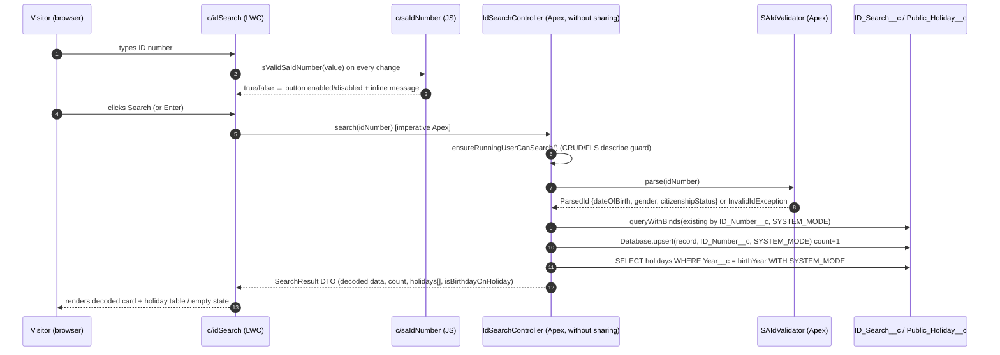

# SA ID Search — Technical Design Document

Everything in this document is taken from the code and metadata in this repository and from what was
observed while deploying it to the `vscodeOrg` Developer Edition org on 2026-09-21/22. Where something was
not verified, it is marked **[unverified]**.

---

## 1. Overview

### 1.1 The problem and the end result

The CloudSmiths Salesforce Developer Assignment asks for four user stories:

1. A public web page where a visitor enters a South African ID number and presses **Search**.
2. The Search button must stay disabled until the number is a *valid* SA ID number, with an inline message
   when it is not.
3. Every valid search is stored: the ID number (unique), the data decoded from it (date of birth, gender,
   citizenship status) and a counter of how many times that number has been searched.
4. After the save, the public holidays for the ID's birth year are fetched from the Calendarific API and shown
   to the visitor.

The end result is a live, anonymous Experience Cloud (LWR) site at
`https://withgoodness-dev-ed.trailblaze.my.site.com/idsearch/`. A visitor types an ID number; the button
enables the instant the number passes the format, date, citizenship and Luhn-checksum rules; on Search the
server re-validates, upserts an `ID_Search__c` record (incrementing `Search_Count__c`), reads the cached
public holidays for the birth year from `Public_Holiday__c`, and returns everything in one response. The
page shows the decoded data, the full holiday list for that year, and highlights the row (plus a banner) if
the visitor's birthday is itself a public holiday. If that year has not been cached yet, the page says so
while the search is still recorded.

The holiday cache is filled by a separate, internal-context process (`HolidaySyncService` via a batch and an
annual scheduled job) that calls Calendarific. **The guest-facing transaction never makes a callout.**

### 1.2 High-level architecture

Two independent halves share one table (`Public_Holiday__c`):

| Half | Runs as | Components | Touches |
|---|---|---|---|
| **Guest search** (synchronous, per request) | Site guest user, via the `c/idSearch` LWC | `c/saIdNumber` → `IdSearchController` → `SAIdValidator` | writes `ID_Search__c`, reads `Public_Holiday__c` |
| **Holiday sync** (asynchronous, internal) | Admin / scheduled job | `HolidaySyncScheduler` → `HolidaySyncBatch` → `HolidaySyncService` → `CalendarificService` → `WebServiceSettings` | writes `Public_Holiday__c` and `Integration_Log__c`, reads `Web_Service_Setting__mdt`, calls out through Named Credential `Calendarific` |

Access is split the same way: `ID_Search_Guest_Access` (site guest user) and `SA_ID_Search_Admin`
(admins and the user who deploys/runs tests).

### 1.3 Control flow diagrams

Guest search (one HTTP request from the browser → one Apex transaction):



Holiday sync (internal, never triggered by the site):

```mermaid
flowchart TD
    A[HolidaySyncScheduler<br/>cron 0 0 2 1 1 ? *] -->|execute()| B[HolidaySyncBatch.run years]
    X[Admin: scripts/apex/*.apex] -->|runRange / syncYear| B
    B -->|scope = 1, one year per execute| C[HolidaySyncService.syncYear year]
    C --> D[CalendarificService.fetchHolidays year]
    D -->|buildRequest name, year| W[WebServiceSettings]
    W -->|reads Named_Credential__c, Path__c, Api_Key__c| F[(Web_Service_Setting__mdt.Calendarific_Holidays)]
    W -->|HttpRequest: callout:Calendarific + merged Path__c| D
    D -->|GET| E[(Calendarific API)]
    E --> D
    D -->|List of Holiday| C
    C -->|upsert on External_Key__c| G[(Public_Holiday__c)]
    C -->|always, success or failure| H[(Integration_Log__c)]
```

---

## 2. Component breakdown

### 2.1 Data model

#### `ID_Search__c` (label "ID Search") — PII

One record per distinct ID number ever searched.

| Setting / field | Value | Why |
|---|---|---|
| Name | AutoNumber `IDS-{00000}` | Guests must not have to supply a name; the ID number is the real key. |
| Sharing | Internal **Private**, external **Private** | Contains a national ID number and derived DOB. No guest sharing rules exist, so no guest can read any record through a sharing-enforced path. |
| `ID_Number__c` | Text(13), **Unique (case-sensitive)**, **External ID**, required | Makes "same ID → same record" a database guarantee and enables `upsert … ID_Number__c`. |
| `Date_Of_Birth__c` | Date | Decoded from digits 1–6. |
| `Gender__c` | Restricted picklist Female / Male | Decoded from digits 7–10. Picklist (not checkbox) so list views/reports read naturally. |
| `Citizenship_Status__c` | Restricted picklist SA Citizen / Permanent Resident / Refugee | Decoded from digit 11. |
| `Search_Count__c` | Number(18,0), default 0 | The Story 3 counter. |
| `Last_Searched__c` | Date/Time | Observability only (not an AC). |

Without it: nothing persists, Story 3 and the holiday lookup's year source both disappear.

#### `Public_Holiday__c` (label "Public Holiday") — public reference data

Cache of Calendarific results, one row per holiday.

| Setting / field | Value | Why |
|---|---|---|
| Name | Text(80) | Holiday name (abbreviated to 80) for readable list views. |
| Sharing | Internal **Read** (Public Read Only), external Private | Not sensitive internally; guests read it through system-mode Apex, not sharing. |
| `Holiday_Date__c` | Date, required | |
| `Holiday_Name__c` | Text(255), required | Full name (Name is capped at 80). |
| `Holiday_Type__c` | Text(255) | Calendarific `primary_type` (observed value for ZA: "Public Holiday"). |
| `Year__c` | Number(4,0), required, External ID (indexed) | Denormalised from the date so the per-search lookup is `WHERE Year__c = :year` — an equality on an indexed field instead of a date range. |
| `External_Key__c` | Text(255), **Unique**, **External ID**, required | `ZA-<yyyy-mm-dd>-<slugified name>`; lets the sync re-run with `upsert` and never duplicate. Includes the name because Calendarific returned two holidays on 1994-12-26. |

Without it: the guest path would have to call Calendarific itself (see Key decisions §4.4).

#### `Integration_Log__c` (label "Integration Log") — internal only

One row per `HolidaySyncService.syncYear()` call, success or failure.

| Field | Value |
|---|---|
| Name | AutoNumber `LOG-{000000}` |
| `Process__c` | Text(80), required — always `Calendarific Holiday Sync` |
| `Status__c` | Restricted picklist Success / Failed, required |
| `Year__c` | Number(4,0) |
| `Record_Count__c` | Number(18,0) |
| `Message__c` | Long Text (32768) — "Upserted N holidays for YYYY" or `ExceptionType: message` |

Sharing Private/Private. Without it: a failed scheduled sync would be invisible (batch jobs do not surface
exceptions to anyone).

#### `Web_Service_Setting__mdt` (Custom Metadata Type, label "Web Service Setting")

One record per outbound call. Introduced on 2026-09-22 to replace the original `Api_Setting__mdt` (which
held only the key, with the path hardcoded in Apex).

| Field | Type | Purpose |
|---|---|---|
| `Named_Credential__c` | Text(80), required | Developer name of the Named Credential; the endpoint becomes `callout:<this><Path__c>` |
| `Path__c` | Text(255), required | Path + query **template**. `{apiKey}` is filled from this record, every other `{placeholder}` (e.g. `{year}`) must be supplied by the calling code; values are URL-encoded on merge |
| `Http_Method__c` | Picklist GET/POST | Defaults to GET when blank |
| `Timeout_Ms__c` | Number(6,0) | Defaults to 30000 when blank |
| `Api_Key__c` | Text(255) | The secret; blank in source |

Record `Web_Service_Setting.Calendarific_Holidays`: Named Credential `Calendarific`, method GET, timeout
30000, path `/holidays?api_key={apiKey}&country=ZA&year={year}&type=national`, key **blank**
(`xsi:nil="true"`). The real key is typed into the org afterwards and must never be committed. **Do not
redeploy this record after the key has been set or it will be blanked again** — either remove it from the
deploy or add it to `.forceignore`.

Why a template: an admin can change country, type or add `&location=…` by editing the record; the code only
knows about `{year}`. Type `visibility = Protected` is only meaningful inside a managed package.

Without it: `WebServiceSettings.getSetting()` throws `ERROR_SETTING_NOT_FOUND` before any callout.

#### Named Credential `Calendarific` (legacy format)

```xml
<endpoint>https://calendarific.com/api/v2</endpoint>
<principalType>Anonymous</principalType>
<protocol>NoAuthentication</protocol>
```

Used purely for endpoint allow-listing (`callout:Calendarific/...`) so no Remote Site Setting is needed. It
does not carry the key, because Calendarific wants the key as a `?api_key=` query parameter, which Named
Credential auth substitution does not model. Deployed fine as legacy metadata on API 67.

#### Tabs and app

Custom tabs for the three objects and a Lightning app **SA ID Search Admin** containing them. Convenience for
admins/demos only.

### 2.2 Apex — guest path

#### `SAIdValidator` (`public with sharing`)

The single source of truth for what a valid SA ID number is. Layout `YYMMDD SSSS C A Z`:

| Digits | Meaning | Rule enforced |
|---|---|---|
| 1–6 | Date of birth YYMMDD | Must be a real calendar date after century inference |
| 7–10 | Gender sequence | `0000–4999` Female, `5000–9999` Male |
| 11 | Citizenship | `0` SA Citizen, `1` Permanent Resident, `2` Refugee — anything else invalid |
| 12 | Legacy digit | Ignored (historically race classification; carries no meaning today) |
| 13 | Luhn check digit | Luhn over all 13 digits must give `sum mod 10 == 0` |

Public API:

- `isValid(String)` → `Boolean` — never throws.
- `parse(String)` → `ParsedId` (`idNumber`, `dateOfBirth`, `gender`, `citizenshipStatus`) — throws
  `InvalidIdException(ERROR_INVALID_ID)` on failure.
- Public constants `GENDER_*`, `CITIZENSHIP_*`, `ERROR_INVALID_ID` are reused by the controller and tests so
  the picklist strings live in one place.

Both public methods delegate to one private `parseOrNull`, so there is exactly one rule chain:

```apex
String idNumber = rawIdNumber?.trim();
if (idNumber == null || !THIRTEEN_DIGITS.matcher(idNumber).matches()) return null;
Date dateOfBirth = toDateOrNull(inferFullYear(YY), MM, DD);
String citizenshipStatus = CITIZENSHIP_BY_DIGIT.get(idNumber.substring(10, 11));
if (dateOfBirth == null || citizenshipStatus == null || !hasValidLuhnChecksum(idNumber)) return null;
```

Three pieces of logic worth understanding:

1. **Century inference.** The ID has no century. `inferFullYear` picks the most recent century that does not
   put the birth date in the future: `candidate = (currentYear/100)*100 + YY; if candidate > currentYear then
   candidate - 100`. In 2026: `26 → 2026`, `27 → 1927`, `80 → 1980`.
2. **Real-date check.** `Date.newInstance(1999, 2, 30)` does not throw — it rolls to 2 March. So the code
   builds the date and compares `month()`/`day()` back to the inputs; a mismatch means the date did not exist.
3. **Luhn.** Walk the 13 digits from the right; double every second digit (starting with the *second* from
   the right), subtract 9 if the doubled value exceeds 9, sum everything; valid when `Math.mod(sum, 10) == 0`.

Without it: no server-side validation, so a client that bypasses the disabled button could persist garbage
(Story 3 AC "only valid searches are stored" would be false).

#### `IdSearchController` (`public without sharing`)

The one `@AuraEnabled` entry point, `search(String idNumber)`, and the only class the guest can execute.
Sequence:

```apex
ensureRunningUserCanSearch();                 // CRUD/FLS describe guard
SAIdValidator.ParsedId parsed = SAIdValidator.parse(idNumber);
ID_Search__c record = recordSearch(parsed);   // 1 SOQL + 1 DML
return buildResult(record, parsed);           // 1 SOQL
```

Any exception is converted by `toAuraException(message)` into an `AuraHandledException` **with
`setMessage()` called** — without that call the LWC (and Apex tests) only see "Script-thrown exception".

`recordSearch` — the upsert-with-increment:

```apex
List<ID_Search__c> existing = Database.queryWithBinds(
  'SELECT Id, Search_Count__c FROM ID_Search__c WHERE ID_Number__c = :idNumber LIMIT 1',
  new Map<String, Object>{ 'idNumber' => parsed.idNumber },
  AccessLevel.SYSTEM_MODE);
ID_Search__c record = existing.isEmpty() ? new ID_Search__c(Search_Count__c = 0) : existing[0];
record.ID_Number__c = parsed.idNumber;   // external-ID upsert needs the key on EVERY row
... set decoded fields, Last_Searched__c ...
record.Search_Count__c = (record.Search_Count__c == null ? 0 : record.Search_Count__c) + 1;
Database.upsert(record, ID_Search__c.ID_Number__c, true, AccessLevel.SYSTEM_MODE);
```

Why the shape is what it is:

- A plain `upsert` cannot *increment* — it overwrites. Hence query-then-upsert, always exactly one query and
  one DML regardless of new vs. repeat.
- Upserting on the external ID (rather than `insert`/`update` by Id) means that if two first-ever searches for
  the same number race, the second becomes an update instead of a `DUPLICATE_VALUE` failure. Two racing
  *repeat* searches can still lose one increment — accepted (no `FOR UPDATE`), documented in the code.
- **`without sharing` + explicit `AccessLevel.SYSTEM_MODE`.** Guest users do not own the records they create
  (the platform reassigns them to the site's default owner) and have no sharing access to `ID_Search__c`, so
  a sharing-enforced lookup would return nothing and every repeat search would collide on the unique key.
  The counter increment is also an *update*, and the platform refuses to grant Edit to a guest user at all.
  So the data access is deliberately system-mode, bounded by two things: the only `ID_Search__c` query is
  filtered on exactly the ID the caller typed, and the describe guard below still makes the permission set
  the gate.

`ensureRunningUserCanSearch` — the guard:

```apex
Boolean canRecordSearch = ID_Search__c.SObjectType.getDescribe().isCreateable();
for (Schema.SObjectField field : ID_SEARCH_WRITTEN_FIELDS)   // 6 fields
  canRecordSearch = canRecordSearch && field.getDescribe().isCreateable();
if (!canRecordSearch || !Public_Holiday__c.SObjectType.getDescribe().isAccessible())
  throw new SearchException(ERROR_NO_ACCESS);
```

It checks **Create** (object + FLS on every written field) and **Read** on `Public_Holiday__c` — exactly
what the guest permission set grants and the strongest grant a guest may hold. A user without the permission
set is refused before any DML.

`buildResult`/`queryHolidays` — one SOQL `WHERE Year__c = :birthYear WITH SYSTEM_MODE ORDER BY
Holiday_Date__c`, mapped into `HolidayResult` DTOs with `isOnDateOfBirth = Holiday_Date__c ==
parsed.dateOfBirth`; `isBirthdayOnHoliday` is the OR of those flags.

Cost per call: **2 SOQL, 1 DML, 0 callouts** (asserted by tests).

DTOs (`SearchResult`, `HolidayResult`) are inner classes with `@AuraEnabled` properties. The LWC never
queries an object directly — everything it shows comes back in this one response.

### 2.3 Apex — sync path

#### `WebServiceSettings` (`public with sharing`)

Resolves a `Web_Service_Setting__mdt` record into a ready-to-send `HttpRequest`:

```apex
HttpRequest request = WebServiceSettings.buildRequest('Calendarific_Holidays',
                                                     new Map<String, String>{ 'year' => '1994' });
// endpoint = 'callout:' + Named_Credential__c + mergePath(...)
```

`mergePath`: if the template contains `{apiKey}`, the record's `Api_Key__c` must be non-blank (else
`SettingException(ERROR_MISSING_API_KEY)`) and is added to the value map; then every `{name}` found by the
regex `\{([A-Za-z0-9_]+)\}` is replaced with the URL-encoded value, or
`SettingException(ERROR_UNRESOLVED_PLACEHOLDER)` names the missing one. Method and timeout default to
GET / 30000. `getSetting()` consults the `@TestVisible static Map<String, Web_Service_Setting__mdt>
settingOverrides` first (custom metadata cannot be inserted in tests), then
`Web_Service_Setting__mdt.getInstance()`; an unknown name → `SettingException(ERROR_SETTING_NOT_FOUND)`.

Gotcha inside: the error constants use `{0}`/`{1}` only — a literal `{apiKey}` in a `String.format`
pattern throws "This method is not available in MessageFormat objects that use alphanumeric argument names".

#### `CalendarificService` (`public with sharing`)

Thin HTTP client. `fetchHolidays(Integer year)`:

```apex
HttpRequest request = WebServiceSettings.buildRequest(
  SETTING_DEVELOPER_NAME,                                   // 'Calendarific_Holidays'
  new Map<String, String>{ YEAR_PLACEHOLDER => String.valueOf(year) });
HttpResponse response = new Http().send(request);
if (response.getStatusCode() != 200) throw new CalendarificException('Calendarific returned HTTP {0} {1}');
return parseHolidays(response.getBody());
```

- The class no longer knows the URL: country, `type=national` and the key all live in the record's path
  template; it only supplies `{year}`. For ZA the rows come back with `primary_type = "Public Holiday"`
  (observed live). The stories ask for banking/public holidays, so observances are not requested.
- A blank key or a bad template fails in `WebServiceSettings` *before* any callout.
- `parseHolidays` uses `JSON.deserializeUntyped` because the payload's keys `date` and `type` are reserved
  words that cannot be Apex member names. It reads `name`, `primary_type` and `date.datetime.{year,month,day}`
  (falling back to the first 10 chars of `date.iso`, which for some entries carries a time and offset). Any
  cast/shape/null failure is rethrown as `CalendarificException(ERROR_MALFORMED_RESPONSE)`.
- Returns `List<Holiday>` (`name`, `holidayDate`, `primaryType`) — a plain wrapper so callers never touch
  the JSON.

#### `HolidaySyncService` (`public with sharing`)

`syncYear(Integer year)` → `SyncResult {year, holidayCount, isSuccess, errorMessage}`:

```apex
try {
  List<Public_Holiday__c> holidays = toRecords(CalendarificService.fetchHolidays(year));
  upsert holidays External_Key__c;
  result.holidayCount = holidays.size(); result.isSuccess = true;
} catch (Exception e) {
  result.errorMessage = e.getTypeName() + ': ' + e.getMessage();
}
logResult(result);   // insert Integration_Log__c, always
```

`toRecords` maps each `Holiday` to a `Public_Holiday__c` (`Name` abbreviated to 80, `Year__c` taken from the
date). `buildExternalKey` produces `ZA-2024-05-01-workers-day-observed`: lower-case, every run of
non-alphanumerics collapsed to `-`, leading/trailing `-` stripped, capped at 255.

It **catches everything** so that in a batch/scheduled context the outcome is a log row, not an unhandled
exception nobody sees. Re-running the same year updates in place (upsert on `External_Key__c`), which the
tests prove. Note: holidays removed upstream are *not* deleted locally (upsert only).

#### `HolidaySyncBatch` (`Database.Batchable<Integer>, Database.AllowsCallouts`)

- `start` returns the `List<Integer>` of years; `execute` calls `HolidaySyncService.syncYear` for each year
  in scope; `finish` is empty.
- `run(List<Integer>)` → `Database.executeBatch(batch, SCOPE_SIZE)` with **`SCOPE_SIZE = 1`**.
- `runRange(from, to)` expands to a list and calls `run`.

Why scope 1: each year is callout → DML. Apex forbids a callout after uncommitted DML in the same
transaction, so a scope of 2 would fail on the second year's callout. Scope 1 also isolates failures — one
year hitting a 429 cannot take the others down.

#### `HolidaySyncScheduler` (`Schedulable`)

- `CRON_ANNUAL = '0 0 2 1 1 ? *'` — 02:00 on 1 January every year; `scheduleAnnual()` registers it under
  `JOB_NAME`.
- `yearsToSync()` → `[currentYear, currentYear + 1]` (refresh this year, pre-warm next) unless the
  `@TestVisible static yearsToSyncOverride` is set — tests can only run one batch scope.
- `execute()` → `HolidaySyncBatch.run(yearsToSync())`.

### 2.4 Lightning Web Components

#### `c/saIdNumber` (JS-only service module, `isExposed = false`)

Exports `parseSaIdNumber(raw) → {idNumber, dateOfBirth: Date, gender, citizenshipStatus} | null`,
`isValidSaIdNumber(raw)`, `GENDER_FEMALE`, `GENDER_MALE`. Same rule chain and same order as
`SAIdValidator`, in JavaScript, so the button can react on every keystroke with no server round-trip.

JS-specific wrinkle: `new Date(1, 0, 1)` treats years 0–99 as 1900–1999, so `toDateOrNull` calls
`candidate.setFullYear(year, month - 1, day)` before the round-trip comparison.

It is UX only. It must never be the sole place a rule lives — the file header says so.

#### `c/idSearch` (UI, `isExposed = true`, label "SA ID Search")

Targets: `lightningCommunity__Page`, `lightningCommunity__Default` (so it appears in Experience Builder),
plus `lightning__AppPage` / `lightning__HomePage` for internal testing.

State: `idNumber`, `result`, `errorMessage`, `isSearching`, `hasLeftInput`. Getters drive the template:

| Getter | Logic |
|---|---|
| `isIdValid` | `isValidSaIdNumber(this.idNumber)` |
| `isSearchDisabled` | `!isIdValid \|\| isSearching` — the AC 2.1 gate and the double-click guard |
| `validationMessage` | empty input → `''`; non-digits → "digits only"; `< 13` digits → "13 digits long" only after blur (`hasLeftInput`), otherwise `''` while still typing; 13 digits but invalid → "not a valid South African ID number" |
| `hasHolidays` | `Boolean(result?.holidays?.length)` — chooses table vs. "not available yet" box |
| `holidayRows` | adds a `key` and a `rowClass` (`birthday-row` when `isOnDateOfBirth`) |

Handlers: `handleIdChange` trims and clears any old server error; `handleIdBlur` sets `hasLeftInput`;
`handleKeyUp` submits on Enter when enabled; `handleSearch`:

```js
this.isSearching = true; this.errorMessage = undefined; this.result = undefined;
try   { this.result = await search({ idNumber: this.idNumber }); }
catch (error) { this.errorMessage = error?.body?.message || ERROR_UNEXPECTED; console.error(...); }
finally { this.isSearching = false; }
```

Errors are shown inline (`slds-notify_alert`, `role="alert"`) rather than via a toast — reliable on a public
LWR page. The validation message sits in an `aria-live="polite"` region.

Template regions: description block → `lightning-input` (`max-length="13"`) → validation message →
`lightning-button.search-button` → spinner while searching → error alert → results: `<dl>` of decoded
values (`lightning-formatted-date-time` with `time-zone="UTC"` so the Date does not shift a day), a
success box "Your birthday falls on a public holiday!" or a muted "not a public holiday" line, the
`slds-table` of holidays (badge "Your birthday" on the matching row), or the "not available yet" box.

### 2.5 Security metadata

#### Permission set `ID_Search_Guest_Access` (assigned to the site guest user)

- `ID_Search__c`: **Read + Create** only (`allowEdit/allowDelete = false`). FLS editable on the five
  non-required fields (`ID_Number__c` is required, so it cannot carry an FLS entry and is always writable).
- `Public_Holiday__c`: **Read** only; FLS on `Holiday_Type__c` (the other four fields are required).
- `classAccesses`: `IdSearchController` only.

Why exactly this: the platform enforces that (a) Create depends on Read at deploy time and (b) a guest user
can never be assigned Edit or Delete. Record visibility is *not* granted by this set — it comes from the
sharing model, which is Private with no guest sharing rules, so a guest cannot list or read back anyone's
`ID_Search__c` through LDS, list views, reports or `with sharing` Apex.

#### Permission set `SA_ID_Search_Admin` (assigned to the deploying admin)

Full CRUD + View All/Modify All on the three objects, FLS on all non-required fields, the app and tabs
visible, class access to the five production classes. Needed because deploying custom fields grants FLS to
nobody, and the test/deploy user must be able to see the fields (see Gotchas §6.4).

### 2.6 Experience Cloud site

- Created with `sf community create --name "SA ID Search" --template-name "Build Your Own (LWR)"
  --url-path-prefix idsearch`. The org already had Digital Experiences enabled with domain
  `withgoodness-dev-ed.trailblaze.my.site.com`.
- Metadata retrieved into source: `digitalExperiences/site/SA_ID_Search1/**` (DigitalExperienceBundle),
  `digitalExperienceConfigs/SA_ID_Search1`, `networks/SA ID Search`.
- Three edits made to the retrieved metadata:
  1. `sfdc_cms__view/home/content.json`: the placeholder `community_builder:htmlEditor` component in
     column 1 replaced by `{ "definition": "c:idSearch", "attributes": {}, "type": "component" }`; SEO
     title/description set.
  2. `sfdc_cms__site/SA_ID_Search1/content.json`: `authenticationType` set to
     `AUTHENTICATED_WITH_PUBLIC_ACCESS_ENABLED` (the "Guest users can see and interact with your site
     without logging in" toggle).
  3. `networks/SA ID Search.network-meta.xml`: `<status>Live</status>`.
- Then `sf community publish --name "SA ID Search"`. The site's guest user is
  `sa_id_search@00d8d00000ay165ead.org.force.com` (Id `005J6000002wowQIAQ`); the guest permission set was
  assigned to it with a `PermissionSetAssignment` record.
- Verified: an anonymous `curl` of `/idsearch/` returns HTTP 200 (no login redirect) and the compiled
  `home_view` module served publicly contains `c/idSearch`.

### 2.7 Scripts (`scripts/apex/`)

| Script | Does |
|---|---|
| `syncHolidays.apex` | `HolidaySyncBatch.runRange(currentYear - 5, currentYear + 1)` |
| `syncSingleYear.apex` | `HolidaySyncService.syncYear(yearToSync)` synchronously (edit `yearToSync`, currently 1994) |
| `scheduleHolidaySync.apex` | `HolidaySyncScheduler.scheduleAnnual()` |

All are run with `sf apex run -o <org> -f <file>`, or inline: `echo "HolidaySyncService.syncYear(1994);" | sf apex run -o <org>`.

### 2.8 Test support classes

- `TestDataFactory` (`@IsTest`): `buildSaIdNumber(dob, isMale, citizenshipDigit[, sequence])` mints a valid
  ID with a correct Luhn digit (`luhnCheckDigit(first12)`); `createPublicHolidays(year, count)` inserts
  `count` rows one week apart starting 1 Jan; `createRestrictedUser()` creates a user on
  "Minimum Access - Salesforce" (or "Standard User") inside `System.runAs(current user)` to avoid mixed-DML;
  `assignPermissionSet(userId, name)`.
- `CalendarificCalloutMock` (`@IsTest`, `HttpCalloutMock`): records every request; `success(year, n)`
  builds a realistic payload (`meta`, `response.holidays[]` with `date.iso` carrying `T00:00:00+02:00` and
  `date.datetime` parts, `type[]`, `primary_type`).

---

## 3. Step-by-step build guide

Prerequisites: Salesforce CLI, Node 22 (`npm install`), an org with Digital Experiences enabled, a
Calendarific API key of your own.

| # | Create | Key settings | Confirm before moving on |
|---|---|---|---|
| 1 | Objects `ID_Search__c`, `Public_Holiday__c`, `Integration_Log__c` + fields (§2.1) | `enableSharing`, `enableBulkApi`, `enableStreamingApi` must all be the same value; `ID_Number__c` and `External_Key__c` unique external IDs; `Year__c` external ID; sharing as in §2.1 | `sf project deploy start --source-dir force-app/main/default/objects` succeeds |
| 2 | `Web_Service_Setting__mdt` + 5 fields + record `Calendarific_Holidays` (blank key, templated path) | `fieldManageability = DeveloperControlled` on every field | deploys; record visible under Setup → Custom Metadata Types |
| 3 | Named Credential `Calendarific` | legacy: endpoint `https://calendarific.com/api/v2`, Anonymous, NoAuthentication | deploys |
| 4 | Tabs ×3, app `SA_ID_Search_Admin` | — | deploys (tabs must come with/after objects) |
| 5 | `SAIdValidator` + `TestDataFactory` + `SAIdValidatorTest` | vectors from §5.1 | `sf apex run test --tests SAIdValidatorTest` → 13/13 |
| 6 | `WebServiceSettings` + `WebServiceSettingsTest`; `CalendarificService`, `CalendarificCalloutMock`, `CalendarificServiceTest` | `settingOverrides` map for tests; `{year}` placeholder; untyped JSON parsing | 9/9 and 8/8 |
| 7 | `HolidaySyncService`, `HolidaySyncBatch` (scope 1), `HolidaySyncScheduler`, `HolidaySyncServiceTest` | catch-all + log; `yearsToSyncOverride` | 10/10 |
| 8 | `IdSearchController` + `IdSearchControllerTest` | `without sharing`, `AccessLevel.SYSTEM_MODE`, `WITH SYSTEM_MODE`, describe guard, `setMessage()` | compiles (tests need step 9–10) |
| 9 | Permission sets `ID_Search_Guest_Access` (Read+Create / Read / class) and `SA_ID_Search_Admin` | no FLS rows for required fields; descriptions ≤ 255 chars | deploy classes + permissionsets **together** (class access references the class) |
| 10 | `sf org assign permset -n SA_ID_Search_Admin` to yourself | — | `sf apex run test` for all five test classes → 49/49, coverage ≥ 95% per class |
| 11 | LWC `saIdNumber` (JS + meta) and `idSearch` (html/js/css/meta + tests) | targets include `lightningCommunity__Page/Default` | `npm test` → 27/27; `npm run lint` clean; deploy `lwc` |
| 12 | Set the API key in `Web_Service_Setting__mdt.Calendarific_Holidays` in the org | — | `echo "HolidaySyncService.syncYear(1994);" \| sf apex run` → Integration Log row Success, 16 holidays |
| 13 | Warm the cache and schedule: `scripts/apex/syncHolidays.apex`, `scripts/apex/scheduleHolidaySync.apex` | — | AsyncApexJob Completed 7/7, 0 errors; CronTrigger exists |
| 14 | `sf community create --name "SA ID Search" --template-name "Build Your Own (LWR)" --url-path-prefix idsearch` | wait for `BackgroundOperation` Complete | `SELECT Id, GuestUserId FROM Site WHERE UrlPathPrefix='idsearch'` returns a row |
| 15 | Retrieve `DigitalExperienceBundle:site/SA_ID_Search1`, `Network:SA ID Search`; make the three edits in §2.6; deploy | enum is `AUTHENTICATED_WITH_PUBLIC_ACCESS_ENABLED` | deploy succeeds |
| 16 | Assign `ID_Search_Guest_Access` to the site guest user (`PermissionSetAssignment`) | guest may hold only Read/Create | record created (no FIELD_INTEGRITY_EXCEPTION) |
| 17 | `sf community publish --name "SA ID Search"` | wait ~1 min | `curl -L https://<domain>/idsearch/` → 200, not the login page; the served `home_view` contains `c/idSearch` |
| 18 | Manual UAT in a **private/incognito** window | search `8001015009087` (1980) and a 1994-born ID | record's `CreatedBy` is the *Site Guest User*; holiday list renders for cached years |

---

## 4. Key decisions

### 4.1 LWC instead of Screen Flow
Story 2 needs live, per-keystroke button gating and inline messages. That is awkward in Screen Flow and
natural in an LWC. Chosen: one UI component (`idSearch`) plus a JS service module (`saIdNumber`) rather than
splitting input/results into child components — the page is small and decomposition would only add
prop-passing.

### 4.2 Validation in two places, one rule set
Client JS for instant UX; Apex as the authority before any DML. Both are exercised against the **same
13-vector table** (§5.1) so they cannot drift silently. Alternative rejected: calling Apex per keystroke
(latency, needless server load, and still needs a server check at save time).

### 4.3 Full validation chain, not just Luhn
Format → real date → citizenship ∈ {0,1,2} → Luhn. Luhn alone passes `9913015800084` (month 13). The tests
include four "impossible date but checksum OK" vectors precisely to prove the date check is independent.

### 4.4 Background sync instead of an inline callout (the biggest decision)
The literal reading of Story 4 is "call Calendarific during the search". Rejected because: (a) a public,
unauthenticated request would drive an outbound call with a privileged key; (b) the search is DML-first,
and Apex forbids a callout after uncommitted DML in the same transaction — you would have to reorder or
split the transaction; (c) every repeat search would re-hit a rate-limited API. Chosen: `Public_Holiday__c`
cache filled by an internal-context batch/scheduler; the guest path only reads. Consequence accepted: a year
that has not been synced shows "not available yet" (search still recorded), and there is deliberately **no
guest-triggered on-demand sync**.

### 4.5 Two objects split by sensitivity
`ID_Search__c` (PII, Private) vs. `Public_Holiday__c` (public data). Guest grants differ per object. A
single object holding both would force the broader grant onto the PII.

### 4.6 Guest permissions — what the platform allowed
Planned: Create + Edit, no Read. Reality, confirmed by errors:
- Deploy error `Permission Create ID_Search__c depends on permission(s): Read ID_Search__c` → Read must be
  granted.
- Assignment error `You can't assign permission set … which contains a [update] object permission to a
  guest user. The only object permissions allowed for guest users are read and create` → Edit is
  impossible.
Final: **Read + Create**, record-level containment via the sharing model, counter increment as a system-mode
side effect. This is a *stronger* design: CRUD never gave record-level protection anyway; sharing does.

### 4.7 `without sharing` + explicit `AccessLevel.SYSTEM_MODE`
Needed so the repeat-search lookup finds a record the guest does not own and the update succeeds without an
Edit grant. Tried first: plain `[SELECT …]` / `upsert` relying on the classic "Apex runs in system mode"
default. It failed in this org at API 67 for a Create-only user (`DML operation UPDATE not allowed on
ID_Search__c`), so the access level is now stated explicitly on the query (`Database.queryWithBinds(…,
AccessLevel.SYSTEM_MODE)`), the DML (`Database.upsert(…, AccessLevel.SYSTEM_MODE)`) and the holiday SOQL
(`WITH SYSTEM_MODE`). The exposure is bounded (§2.2) and a describe guard keeps the permission set the gate.
**[unverified]** whether this is a documented API-67 default change or an org setting — it was observed, not
looked up.

### 4.8 Query-then-upsert for the counter; accept the race
`upsert` alone overwrites. Query the existing row, add 1, upsert on the external ID. Concurrent *first*
searches are safe (second becomes an update); concurrent *repeat* searches can lose one increment. `FOR
UPDATE` locking was considered and rejected as disproportionate for this tool.

### 4.9 Settings in Custom Metadata, host in a Named Credential
Calendarific wants `?api_key=` as a query parameter; Named Credential auth substitution targets headers/body.
So the NC only allow-lists the host and the key lives in custom metadata, read only by the sync classes.
First version: `Api_Setting__mdt` with just the key and the path hardcoded in Apex. Replaced on 2026-09-22 by
`Web_Service_Setting__mdt` with a templated `Path__c` so admins can change query parameters (country, type,
location) without a deploy; the code supplies only `{year}`. The old type was removed with a destructive
change after the key was copied across via a temporary metadata package (never committed).
The key printed in the assignment PDF was treated as compromised (shared with every candidate) — a private
key is used and never committed.

### 4.10 `type=national` only
The stories ask for banking/public holidays. Requesting only Calendarific's national category avoids storing
observances and then having to filter by guessed type labels. Verified live for ZA (`primary_type` =
"Public Holiday"). Making `type`/`location` configurable was discussed and left out of scope.

### 4.11 Composite external key includes the holiday name
First idea `ZA-2024-12-25` (date only). Rejected once a live pull showed two holidays on 1994-12-26 ("Day
off for Christmas Day" + "Day of Goodwill") — a date-only key would collapse them.

### 4.12 Batch with scope 1 rather than a single-transaction loop or Queueable chain
A loop over years in one transaction dies on the second callout (callout after DML). Scope-1 batch gives one
transaction per year and isolates failures; `runRange` makes admin backfills trivial.

### 4.13 Failure logging to a custom object
Options: custom log object, platform event, email. Chosen `Integration_Log__c` — queryable, visible in a
tab, easy to assert in tests, no deliverability dependency.

### 4.14 Counter semantics
Every successful server-side search increments (literal AC wording). Double-clicks are prevented client-side
by disabling the button while a request is in flight; no session dedup.

### 4.15 `@TestVisible` overrides instead of test-only branches
`CalendarificService.settingOverride` (CMDT cannot be inserted in tests) and
`HolidaySyncScheduler.yearsToSyncOverride` (tests may run one batch scope). Both are documented in-line.

### 4.16 Inline error UI rather than toast
The org's usual shared toast component does not exist in this project, and toast support on public LWR pages
is less predictable; an inline `role="alert"` box plus `console.error` was chosen.

---

## 5. Testing

### 5.1 Shared SA ID test vectors

| Vector | Meaning |
|---|---|
| `8001015009087` | valid — male, SA citizen, 1980-01-01 (widely published example) |
| `9002200472089` | valid — female, citizen, 1990-02-20 |
| `8512315123188` | valid — male, permanent resident, 1985-12-31 |
| `0107152345289` | valid — female, refugee, 2001-07-15 |
| `0002290001086` | valid — female, citizen, 2000-02-29 (leap day, YY=00 → 2000) |
| `7506154999089` / `7506155000085` | gender boundary 4999 (female) / 5000 (male) |
| `8001015009088` | invalid — check digit off by one |
| `9913015800084` | invalid — month 13, checksum OK |
| `9902305800086` | invalid — 30 Feb, checksum OK |
| `9902290001088` | invalid — 29 Feb 1999 (not leap), checksum OK |
| `8001005009089` | invalid — day 00, checksum OK |
| `8001015009384` | invalid — citizenship digit 3, checksum OK |

They live in `SAIdValidatorTest.cls` and `lwc/saIdNumber/__tests__/saIdNumber.test.js`; change both together.

### 5.2 Apex (49 tests, 99% coverage; run with
`sf apex run test -o <org> --tests SAIdValidatorTest --tests CalendarificServiceTest --tests HolidaySyncServiceTest --tests IdSearchControllerTest --tests WebServiceSettingsTest --code-coverage`)

**WebServiceSettingsTest (9)** — caller placeholder + record key merged into
`callout:Calendarific/holidays?api_key=secret&year=1994`; merged values URL-encoded (`a b&c` → `a+b%26c`);
a placeholder used twice is replaced everywhere; an unsupplied placeholder raises `SettingException` naming
it; blank key with `{apiKey}` in the path raises the missing-key message; blank key is fine when the path has
no `{apiKey}`; method/timeout default when blank; unknown developer name raises; and the **deployed**
`Calendarific_Holidays` record is read to assert it still carries `{apiKey}`, `{year}`, `country=ZA` and
`type=national`.

**SAIdValidatorTest (13)** — the rule chain: published example decodes correctly; all three citizenship
digits; gender boundary; 2000s dates incl. leap day; century inference never in the future (uses
`Date.today()`); checksum off-by-one rejected; four impossible-date vectors rejected despite valid checksum;
unknown citizenship rejected; null/empty/whitespace/12/14 digits/letter O/punctuation → `false` without
throwing; surrounding whitespace trimmed; `parse` throws `InvalidIdException` with `ERROR_INVALID_ID`;
factory IDs round-trip; 400 validations in one transaction with `Limits.getQueries() == 0` captured inside
`startTest/stopTest`.

**CalendarificServiceTest (8)** — mocked callouts with an in-memory setting registered via
`TestDataFactory.useCalendarificSetting(key)`: well-formed payload parsed (names, `datetime` parts, type) and
exactly 1 callout counted; endpoint contains `callout:Calendarific/holidays?`, URL-encoded key, `country=ZA`,
`year=`, `type=national`, method GET; blank key → `WebServiceSettings.SettingException` and **zero** requests; 401 and
429 → exception containing the status code; HTML body → malformed-response exception; missing `holidays`
array / missing date → parse exception; `iso` fallback when `datetime` absent.

**HolidaySyncServiceTest (10)** — sync upserts N rows with correct fields and key and writes a Success log;
re-run does not duplicate and refreshes stale values (matched by `External_Key__c`); 500 → Failed log with
exception type + status, no rows, no throw; missing key → Failed log; key slugification; batch via
`runRange(Y, Y)` syncs and logs; `start()` yields every year and `SCOPE_SIZE == 1`; scheduler registers a
`CronTrigger` with the documented cron/name; `yearsToSync()` = current + next; `execute()` with
`yearsToSyncOverride = [Y]` runs the batch and logs.

**IdSearchControllerTest (9)** — first search creates one record with decoded fields, count 1, timestamp,
and a matching DTO; three searches → one record, count 3; invalid/null/junk → `AuraHandledException` with
`ERROR_INVALID_ID` and zero records; exactly 2 SOQL + 1 DML for a first search and the same again for a
repeat (captured inside `startTest/stopTest`); holidays of the birth year only, ordered, with
`isOnDateOfBirth` and `isBirthdayOnHoliday`; no cached year → empty list, flag false, search still
recorded; 40 distinct IDs in one transaction → 40 records, 80 SOQL, 40 DML (linear); **a restricted user
holding only the guest permission set can search twice** (count 2, holidays returned, one record — proves
the non-owner lookup and the Create-only update path); the same user **without** the set is refused with
`ERROR_NO_ACCESS` and nothing is written.

Why 40 and not 200 for the volume test: at 2 SOQL per search, 200 would exceed the 100-query limit — the
controller is a per-request entry point, not a bulk API.

### 5.3 Jest (27 tests; `npm test`)

**saIdNumber.test.js (11)** — the same vectors as Apex through the JS mirror, plus a generated
current-year/next-year pair for century inference.

**idSearch.test.js (16)** — Story 1: input/description/button render, button disabled and no results
initially. Story 2: partial number → disabled and silent; blur on a short number → "13 digits" message;
non-digits → immediate message; 13 bad digits → disabled + invalid message; valid → enabled, message cleared;
valid edited to invalid → disabled again; pasted whitespace trimmed. Stories 3–4 (Apex mocked with
`jest.mock('@salesforce/apex/IdSearchController.search', …, { virtual: true })`): calls Apex with the ID and
renders decoded values and 3 rows; birthday row gets `birthday-row` class, badge and banner; empty holidays
→ "not available yet" box, no table, decoded data still shown; no match → "not a public holiday" line;
rejected promise with `body.message` → inline error, no results, button re-enabled; error without body →
generic message; button disabled and spinner shown while the promise is pending, one call only; Enter
submits only when valid.

`flushPromises` is two `await Promise.resolve()` turns (ESLint forbids `setTimeout` in LWC tests).

### 5.4 What a green run proves — and what it does not
Proves: the rules, the persistence semantics, the governor footprint, the permission-set gate, the sync's
idempotency and failure logging, and the UI states. Does **not** prove: the real Calendarific contract (done
once live: 1994 → 16 rows, 1948 → 7 rows, 2021–2027 → 7/7 batch executions OK), or a true anonymous browser
session (the only UI search observed so far ran as the logged-in admin — see §6.13).

---

## 6. Gotchas and lessons learned

1. **Object flags must agree.** `Allow Sharing, Allow Bulk API Access, and Allow Streaming API Access must be
   enabled together or disabled together.` — set all three to true.
2. **Permission set description max 255 characters.** Deploy error `data value too large`.
3. **No FLS rows for required fields.** `You cannot deploy to a required field: …` — required fields are
   always readable/editable; leave them out of `fieldPermissions`.
4. **Deploying fields grants FLS to nobody.** Even System Administrator could not see the new fields; tests
   failed with `fields being inaccessible on Sobject …` and `No such column 'Date_Of_Birth__c'`. Fix: the
   `SA_ID_Search_Admin` permission set assigned to the running user.
5. **Create depends on Read** at deploy time; **guests can only ever hold Read and Create** (assignment is
   refused otherwise). Design the guest model around that from the start.
6. **CRUD/FLS was enforced on plain DML/SOQL at API 67 in this org** (`DML operation UPDATE not allowed`
   for a Create-only user). State `AccessLevel.SYSTEM_MODE` / `WITH SYSTEM_MODE` explicitly when you mean it.
   **[unverified]** root cause — observed behaviour only.
7. **External-ID upsert needs the key on every row.** Querying `Id, Search_Count__c` only and upserting on
   `ID_Number__c` gave `MISSING_ARGUMENT, ID_Number__c not specified`. Always set the key field.
8. **`Limits.*` after `Test.stopTest()` reads the outer context** — capture the numbers inside the block.
9. **Tests may run only one `executeBatch` scope**, checked at *enqueue* time: `No more than one executeBatch
   can be called from within a test method`. A 2-year list with scope 1 fails even with no `stopTest()`.
   Hence `yearsToSyncOverride` and scheduler tests that do not wrap `System.schedule` in `startTest/stopTest`.
10. **Callout after DML is illegal even with mocks** — one sync per transaction in tests; seed data before
    `Test.startTest()`.
11. **`AuraHandledException` needs `setMessage()`** or callers see "Script-thrown exception".
12. **Site public-access enum** is `AUTHENTICATED_WITH_PUBLIC_ACCESS_ENABLED` (the deploy error lists the
    valid values). After `sf community publish`, anonymous access took about a minute to stop redirecting to
    `/idsearchvforcesite/login`.
13. **Logged-in admins are site members** (`networkMemberGroups` = admin profile). If you open the site while
    logged into the org, the search runs as *you* and `ID_Search__c.CreatedBy` is you, not the guest. Test
    guest behaviour in a private window.
14. **Cache must be warm before a year is searched.** A 1948 ID searched one minute before the 1948 sync
    finished correctly showed "not available yet" — by design, not a bug. Backfill plausible birth years
    (`HolidaySyncBatch.runRange(1940, 2020)`) before a demo.
15. **Calendarific data quirks:** two holidays on one date (hence the name in the key); older years have
    fewer entries (1948 → 7, 1994 → 16); `date.iso` sometimes carries a time/offset (hence `datetime` parts
    first); JSON keys `date`/`type` are Apex reserved words (hence untyped parsing).
16. **`Date.newInstance` rolls impossible days forward**; JS `new Date(y, m, d)` maps years 0–99 to 19xx —
    both handled explicitly.
17. **`lightning-input` has no `inputmode` property** (Jest warned) — removed.
18. **ESLint `@lwc/lwc/no-async-operation`** rejects `setTimeout` in tests — use microtask awaits.
19. **CMDT record with a blank key is in source.** Redeploying `Web_Service_Setting.Calendarific_Holidays`
    after the key is set will blank the key (the next sync logs "has no API Key").
22. **Scheduled jobs block class deploys.** Once `HolidaySyncScheduler` was scheduled, every deploy touching
    the classes failed with "This schedulable class has jobs pending or in progress". Abort the CronTrigger
    (`System.abortJob`), deploy, re-run `scheduleHolidaySync.apex` — or enable "Allow deployments with Apex
    jobs" in Deployment Settings.
23. **`HttpRequest` has no `getTimeout()`** — the timeout is write-only, so tests cannot assert it.
24. **`String.format` rejects alphanumeric `{names}` in the pattern.** Keep patterns to `{0}`, `{1}` and pass
    literal placeholder text (like `{apiKey}`) as an argument.
20. **A failed deploy rolls back everything in it** (`numberComponentsDeployed` can still show a count) —
    check `status`, and read `sf project deploy report --use-most-recent` when piping output through grep.
21. Tooling (this machine): `sf` under Git Bash must be invoked as `node.exe …/client/bin/run.js` (the `.cmd`
    shim breaks on quoted args); Node lives under nvm and is not on PATH; the bash tool truncated heredocs
    over ~150 lines.

---

## 7. Quiz preparation

### 7.1 Core concepts to be able to explain

- The SA ID layout (`YYMMDD SSSS C A Z`), what each part means, and the four validation rules in order.
- How Luhn works and why a check-digit-only check is insufficient (the "impossible date, checksum OK" vectors).
- Century inference and its edge (`YY == current year` vs `current year + 1`).
- Why validation exists in both JS and Apex, and how drift is prevented.
- Query-then-upsert on an external ID: why not plain upsert, why not insert/update by Id, and the race trade-off.
- `with sharing` vs `without sharing` vs `AccessLevel.SYSTEM_MODE` / `WITH SYSTEM_MODE`, and why the controller needs system mode for a guest.
- What guest users can and cannot be granted (Read/Create only; Create needs Read) and how record-level protection actually comes from sharing.
- The describe-based CRUD/FLS guard: what it checks and why it still matters when Apex is in system mode.
- Why the guest transaction has no callout, and the three concrete reasons an inline callout was rejected.
- Named Credential vs. Custom Metadata for the endpoint and the key.
- `HolidaySyncBatch` scope 1 and the callout-after-DML rule.
- Idempotent sync via `External_Key__c`, and why the key includes the holiday name.
- Failure handling in the sync (catch-all + `Integration_Log__c`).
- The `SearchResult` DTO contract and every UI state it drives (results, birthday match, empty year, error, in-flight).
- Test techniques: `@TestVisible` overrides, `HttpCalloutMock`, `System.runAs` with a restricted user + permission set, capturing `Limits` inside `startTest/stopTest`, one batch scope per test.
- Site mechanics: `authenticationType`, home view JSON, network `Live`, publish, guest user permission assignment.

### 7.2 Questions

**Recall**

1. What are the five segments of a South African ID number and what does each encode?
2. Which digit range makes an ID female, and where is the boundary?
3. What is `8001015009087` and what does it decode to?
4. Name the four validation checks `SAIdValidator.parseOrNull` performs, in order.
5. What does `IdSearchController.search` return, and what fields does the DTO contain?
6. How many SOQL queries, DML statements and callouts does one `search()` call issue?
7. What is stored in `Public_Holiday__c.External_Key__c` and how is it built?
8. What is the cron expression for the annual sync and when does it fire?
9. Which Calendarific query parameters are sent, and where does each value come from? How would you add `&location=gauteng`?
10. What does `Integration_Log__c` record, and when is a row written?
11. Which object permissions does `ID_Search_Guest_Access` grant on each object?
12. What does `HolidaySyncBatch.SCOPE_SIZE` equal and where is it used?

**Reasoning**

13. Why is validation duplicated in JavaScript when Apex already validates?
14. Why can't a plain `upsert` implement the search counter?
15. Why does the controller run `without sharing` *and* pass `AccessLevel.SYSTEM_MODE`?
16. The plan wanted "Create + Edit, no Read" for the guest. Why does the deployed set have Read + Create and no Edit?
17. If Apex bypasses CRUD anyway, what is the point of `ensureRunningUserCanSearch()`?
18. Why does the guest-facing transaction contain no callout? Give three reasons.
19. Why is the API key in a Custom Metadata Type rather than in the Named Credential?
20. Why is the batch scope pinned to 1 instead of syncing all years in one execute?
21. Why does the sync's external key include the holiday name and not just the date?
22. Why does `toDateOrNull` build a `Date` and compare it back to the inputs instead of trusting `Date.newInstance`?
23. Why do the Apex tests capture `Limits.getQueries()` before `Test.stopTest()`?
24. Why does `CalendarificService` use `JSON.deserializeUntyped` instead of typed wrapper classes?

**Scenario**

25. A visitor types `9913015800084`. What does the page show and does anything reach the server?
26. `Web_Service_Setting__mdt.Calendarific_Holidays.Api_Key__c` is blank and the scheduled job runs. What happens, step by step?
27. Two visitors search the same brand-new ID at the same instant. What happens to the record and the counter? What if it was not brand-new?
28. Someone edits `IdSearchController` and changes `without sharing` to `with sharing`. What breaks, and for whom?
29. A visitor searches an ID with birth year 1948 before 1948 has been synced, then again after. What does each search show and what is `Search_Count__c` afterwards?
30. A user with the "Minimum Access - Salesforce" profile and *no* permission set calls `IdSearchController.search` with a valid ID. What happens and why?
31. The Calendarific API returns HTTP 429 during `HolidaySyncBatch.runRange(2020, 2027)` for 2023 only. What is the end state?
32. You redeploy `force-app` after setting the real API key in the org. What can go wrong?

---

### 7.3 Answers

1. `YYMMDD` date of birth; `SSSS` gender sequence; `C` citizenship (0 citizen, 1 permanent resident, 2 refugee); `A` legacy digit (historically race classification, ignored); `Z` Luhn check digit.
2. `0000–4999` is female; `5000–9999` is male. The boundary is 4999/5000 (tested with `7506154999089` and `7506155000085`).
3. The widely published example of a valid SA ID: male, SA citizen, born 1 January 1980.
4. (1) trimmed input matches `^[0-9]{13}$`; (2) YYMMDD (after century inference) is a real calendar date; (3) digit 11 maps to a known citizenship; (4) Luhn over all 13 digits gives `sum mod 10 == 0`. Gender is derived, not validated (any 4 digits are legal).
5. `SearchResult` with `idNumber`, `dateOfBirth`, `gender`, `citizenshipStatus`, `searchCount`, `birthYear`, `isBirthdayOnHoliday`, and `holidays` (list of `HolidayResult`: `name`, `holidayDate`, `holidayType`, `isOnDateOfBirth`).
6. 2 SOQL (existing-record lookup, holiday query), 1 DML (upsert), 0 callouts. Asserted by `searchIssuesExactlyTwoQueriesAndOneDml` and the 40-search volume test.
7. `ZA-<yyyy-mm-dd>-<slug>` where the slug is the holiday name lower-cased with runs of non-alphanumerics replaced by `-` and edges trimmed; capped at 255. E.g. `ZA-2024-05-01-workers-day-observed`.
8. `0 0 2 1 1 ? *` — 02:00 on 1 January every year; it syncs the current year and the next.
9. All from the `Web_Service_Setting__mdt.Calendarific_Holidays` record's `Path__c` template `/holidays?api_key={apiKey}&country=ZA&year={year}&type=national`: `{apiKey}` is merged from the record's `Api_Key__c`, `{year}` from the `fetchHolidays(year)` argument, and country/type are literal text in the template. The host comes from the Named Credential named in `Named_Credential__c`. To add a location, edit the record's path to include `&location=gauteng` — no code change; if you used a `{location}` placeholder instead, `CalendarificService` would have to supply it or `WebServiceSettings` throws an unresolved-placeholder error.
10. Process name, Success/Failed, year, record count and a message ("Upserted N holidays for YYYY" or `ExceptionType: message`). One row per `syncYear` call, always — the method catches every exception.
11. `ID_Search__c`: Read + Create (no Edit/Delete/View All/Modify All). `Public_Holiday__c`: Read only. Plus class access to `IdSearchController`.
12. `1`. Passed to `Database.executeBatch(new HolidaySyncBatch(years), SCOPE_SIZE)` in `run()`.
13. JS gives per-keystroke button gating with no round-trip (the AC 2.1 UX); Apex is the authority because the `disabled` attribute is a DOM property anyone can remove. Drift is prevented by the shared vector table in both test suites.
14. `upsert` overwrites field values; it cannot express "current value + 1". The controller queries the existing row, adds 1, then upserts.
15. `without sharing` because the guest never owns the record it created and has no sharing access, so a sharing-enforced lookup returns nothing and every repeat search would collide on the unique key. Explicit `SYSTEM_MODE` because in this org (API 67) plain DML enforced CRUD for the running user and a Create-only guest cannot be granted Edit, so the increment must be a system-mode operation.
16. The platform rejected both parts of the plan: deploy failed with "Permission Create … depends on … Read", and assigning Edit to the guest user failed with "the only object permissions allowed for guest users are read and create". Record-level protection comes from the Private sharing model (no guest sharing rules), not from CRUD.
17. It keeps the permission set the real gate: a user without Create on the object/fields (or Read on `Public_Holiday__c`) is refused *before* any DML, even though the DML itself would run in system mode. It also documents the exact grants the code relies on.
18. (a) A public request would drive an outbound call with a privileged key; (b) the search is DML-first and Apex forbids a callout after uncommitted DML in one transaction; (c) repeat searches would re-hit a rate-limited API. The cache moves the callout to an internal context and makes the guest path read-only.
19. Calendarific expects the key as a `?api_key=` query parameter; Named Credential authentication substitutes into headers/body, not the query string. The NC is kept for host allow-listing only.
20. Each year is callout → upsert. A second year in the same transaction would attempt a callout after uncommitted DML and fail. Scope 1 gives each year its own transaction and isolates failures.
21. Calendarific returned two holidays on 1994-12-26 ("Day off for Christmas Day" and "Day of Goodwill"). A date-only key would make the second overwrite the first.
22. `Date.newInstance(1999, 2, 30)` silently returns 2 March 1999 instead of failing. Comparing `month()`/`day()` back to the inputs is what actually detects a non-existent date.
23. `Test.stopTest()` returns to the outer limits context, so `Limits.getQueries()` afterwards reflects the setup code, not the code under test. (This bit the first test run: the callout count read 0.)
24. The payload uses `date` and `type` as keys, which are reserved words and cannot be Apex member names; untyped maps sidestep that.
25. It is 13 digits and fails validation (month 13, even though the checksum is fine), so the Search button stays disabled and the inline message "This is not a valid South African ID number…" appears. Nothing is sent to the server.
26. Scheduler `execute` → `HolidaySyncBatch.run([Y, Y+1])` → for each year `syncYear` → `CalendarificService.fetchHolidays` → `WebServiceSettings.buildRequest` sees `{apiKey}` in the path with a blank key and throws `SettingException(ERROR_MISSING_API_KEY)` before any callout → `syncYear` catches it, `isSuccess=false`, writes an `Integration_Log__c` row with Status Failed and the message → batch completes without errors; no `Public_Holiday__c` rows change. The guest site keeps working (it reads the cache).
27. Both read "no existing record" and both upsert on `ID_Number__c`; the first inserts, the second matches the now-existing key and updates — no duplicate error. The counter may end at 1 instead of 2 (lost increment). For an existing record the same lost-increment risk applies; accepted rather than adding `FOR UPDATE`.
28. For guests, the existing-record lookup would return nothing (no sharing access), so every repeat search would try to insert and hit the unique-key constraint, and the holiday query would return no rows. Admin users would be unaffected (they own/see the records). Note the DML and SOQL are already explicitly `SYSTEM_MODE`/`WITH SYSTEM_MODE`, which ignore CRUD/FLS but respect the class sharing keyword — so sharing would be enforced.
29. First search: decoded data shown, count 1, "Public holiday data for 1948 is not available yet…". Second search: same decoded data, count 2, 7 holidays listed with 1 Jan flagged and the green birthday banner (1948-01-01 is New Year's Day). `Search_Count__c` = 2. (This exact sequence happened during UAT.)
30. `ensureRunningUserCanSearch()` finds `isCreateable()` false on `ID_Search__c`, throws `SearchException(ERROR_NO_ACCESS)`, which `search` converts to an `AuraHandledException` with that message. No record is written (tested by `userWithoutGuestPermissionSetIsRefusedBeforeAnyDml`).
31. Eight batch executions run independently. 2023's `fetchHolidays` throws on the non-200 status, `syncYear` catches it and logs a Failed row with "…HTTP 429…"; the other seven years upsert normally and log Success; `AsyncApexJob` shows 8 processed, 0 errors (the failure was caught, not raised). Re-running 2023 later fills the gap idempotently.
32. The `Web_Service_Setting.Calendarific_Holidays` custom metadata record in source has a blank `Api_Key__c`, so a full deploy overwrites the real key with blank and the next sync logs `WebServiceSettings.SettingException: … has no API Key`. Exclude the record from the deploy (or `.forceignore` it) once the key is set. (Also: the site bundle in source would redeploy, which is fine, but it needs a publish afterwards to affect the live site.)
